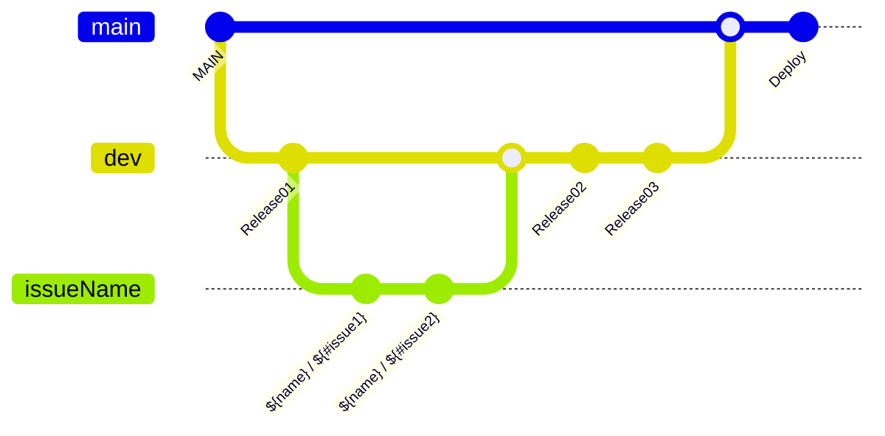

# MetroCity


## 프로젝트 소개
> 지하철 앱을 열어 시간표를 확인하고 역시간에 맞춰서 나왔지만 무슨일인지 근소한차이로 
> 해당 지하철을 놓치고 만다…
> 
> 현재 실시간으로 지하철이 내가 타려는 역에 언제 도착하는지 확인하려는데, 기존 지하철 앱은 지하철 전체 
> 노선도에서 내가 위치한 역을 찾고 , 실시간 탭을 눌러 확인을 해야하니 여간 불편한게 아니다. 
> 이를 행하는 1분 1초마저도 아깝기만 하다.
> 
> 그래서 **그냥 앱을 실행하면 바로 내가 타려는 지하철의 실시간 정보를 확인 할 수 있는 방법이 없을까?**
> 에서 시작된 프로젝트 **뛰어말어!**


### 💫 주요기능
- **`메인`** CLLocation을 활용하여 내 주변역을 바로 알려주고, 해당 역의 실시간 지하철 도착정보를 제공합니다.
- **`메인`** 자신의 위치를 기반으로 가장 가까운 호선을 추천받아 편리하게 지하철을 검색할 수 있습니다.
- **`메인`** 선택한 역의 열차 위치를 실시간으로 확인하고 해당 호선과 관련된 역을 검색할 수 있습니다.
- **`즐겨찾기`** 자신이 자주 사용하는 역 정보를 저장하여 빠르게 지하철의 위치를 확인할 수 있습니다.
- **`설정`** 손 쉽게 테마를 설정하고, 개발자에게 문의 및 사용한 API를 확인할 수 있습니다.


### 📱구동화면
|**`주변역 찾기`**|**`호선과 역 변경`**|**`즐겨찾기`**|**`검색`**|**`다크모드`**|
|-------|-------|-------|-------|-------|
|||| ||


### 💻 개발 환경, 도구 및 활용한 기술

```
- 개발 언어 : Swift
- 개발 환경 : SwiftUI
    - 최소 iOS 16.4
    - iPhone SE ~ iPhone 15 Pro 호환
    - 다크모드 지원
- 디자인 툴 : Figma
- 협업 도구 : Github, Team Notion
- 활용한 기술
    - Xcode, Tuist, SwiftLint
    - MVVM, POP, Clean Architecture
    - Combine, CoreData, CLLocation, URLSession
    - FireStore
```
<br>

### 컨벤션 및 깃플로우 전략
#### 폴더 컨벤션

```
📦MetroCity
    ├──🗂️Tuist
    ├──🗂️Project
    │   ├──🗂️SPM
    │   ├──🗂️FirebaseSPM
    │   ├──🗂️App
    │   │   ├──🗂️Resources
    │   │   ├──🗂️Sources
    │   │   │   ├──🗂️Service
    │   │   │   │   ├──🗂️CLLocations
    │   │   │   │   ├──🗂️CoreDatas
    │   │   │   │   ├──🗂️Firebases
    │   │   │   │   ├──🗂️Protocol
    │   │   │   ├── 🗂️Views
    │   │   │   │   ├── Alert
    │   │   │   │   ├── BookMark
    │   │   │   │   ├── CustomView
    │   │   │   │   ├── MainDetail
    │   │   │   │   ├── MainList
    │   │   │   │   ├── Setting
    │   │   │   │   ├── Start
    │   │   │   │   ├── Toast
    │   │   │   │   ├── View+Extensions
    │   │   │   ├── 🗂️Util
    └───────────────│
```


#### 깃플로우 전략


<br>

### 팀원 소개
<div align="center">  

|[박서연]<br/> [@syss220211](https://github.com/syss220211)<br/> "똑똑한 강원도 감자 개발자입니다🥔" | [조민근]<br/> [@LutherCho](https://github.com/LutherCho)<br/> "진심어린 사과 개발자 🍎" | [신우진]<br/> [@swjtwin](https://github.com/swjtwin) <br/> "깡과 총이있어 강한 개발자입니다." |
| :--------------------------------------------: | :----------------------------------------: | :--------------------------------------: | 
|  |  |  |  

</div>
 

<br>

## 📄 License
### “MetroCity" is available under the MIT license. See the [LICENSE](https://github.com/APPSCHOOL3-iOS/final-zeno/blob/main/LICENSE) file for more info.
- Tuist
- Firebase - iOS

